<div align="center">

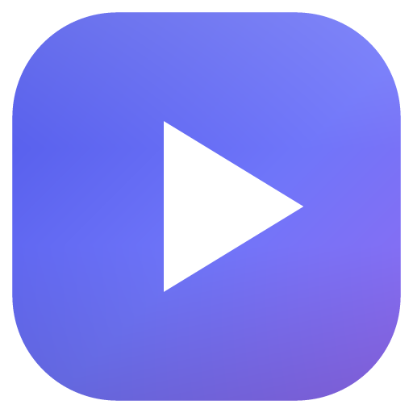

# Lumina

**Your videos, beautifully organized.**<br />
A video player and library manager for Windows: folders become 3D cards, and a 1.5 GB film opens in about a tenth of a second.

<br />

<a href="https://github.com/mohitbansal25082006/Lumina/releases/latest"></a>

<br /><br />

<a href="https://github.com/mohitbansal25082006/Lumina/releases/latest"></a>
<a href="https://github.com/mohitbansal25082006/Lumina/releases"></a>
<a href="https://github.com/mohitbansal25082006/Lumina/stargazers"></a>


<br />

[Features](#-features) · [Screenshots](#-a-closer-look) · [Themes](#-six-themes) · [Performance](#-built-for-speed) · [Shortcuts](#%EF%B8%8F-keyboard-shortcuts) · [Install](#-install) · [Build](#%EF%B8%8F-build-from-source)

<br />

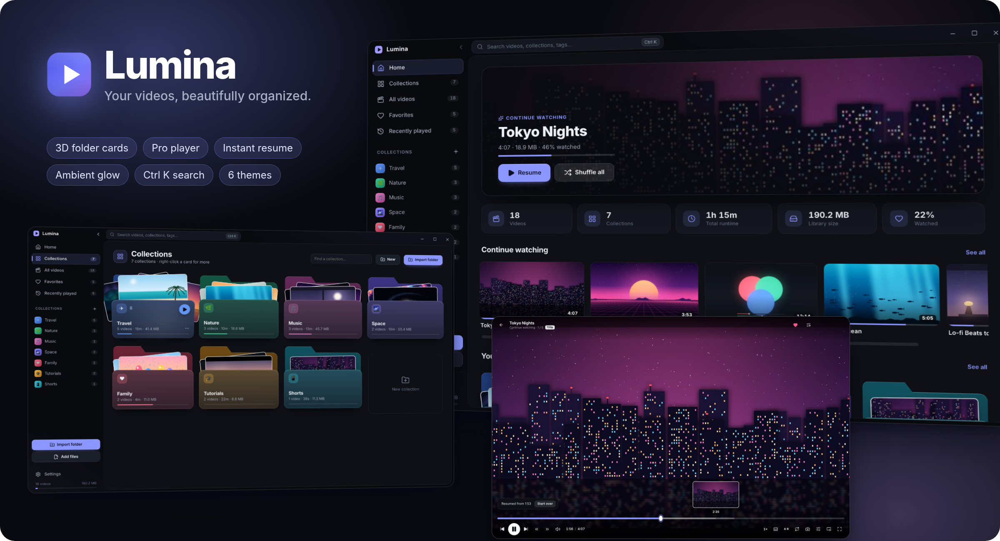

</div>

<br />

## ✨ Features

<table>
<tr>
<td width="33%" valign="top">

### 🗂️ Folder cards
Every folder becomes a 3D card that tilts toward your cursor. Hover it and thumbnails of its videos fan out.

</td>
<td width="33%" valign="top">

### ⚡ Opens instantly
Huge files and long movies open in about 0.1 s. Resuming at 15:00 in a 1.5 GB MKV takes 0.4 s.

</td>
<td width="33%" valign="top">

### 🎬 A proper player
Seek-bar previews, A-B loop, subtitles, 0.25–3× speed, volume boost to 200 %, snapshots and picture controls.

</td>
</tr>
<tr>
<td valign="top">

### ⏯️ Picks up where you left off
Resume on every video, a Continue Watching shelf, autoplay of the next video, and videos marked watched automatically.

</td>
<td valign="top">

### 🌌 Ambient glow
The space around a video glows with its colors. Vertical videos sit on clean black.

</td>
<td valign="top">

### 🔎 Everything in reach
`Ctrl K` searches your whole library. Right-click menus, drag and drop, multi-select, tags and ratings do the rest.

</td>
</tr>
</table>

<div align="center">

### See it in motion

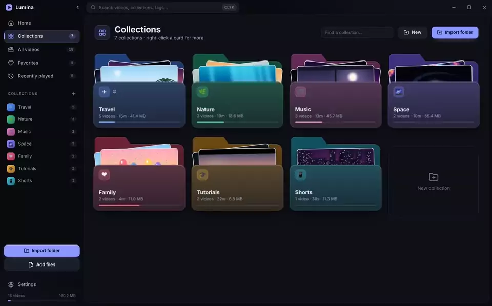

<sub>Folder cards fan open on hover → open a collection → play, with live seek-bar previews</sub>

</div>

<br />

## 📸 A closer look

### Home, your whole library at a glance
A **Continue Watching** hero picks up your last video. Library stats, your collections and recent additions sit on shelves below.


### Collections that look like folders
Every collection gets its own color, icon and cover. Hover a card and the videos inside fan out. Right-click for everything else.


<table>
<tr>
<td width="50%"><p align="center"><sub><b>Inside a collection:</b> banner, resume, sort and filter</sub></p></td>
<td width="50%">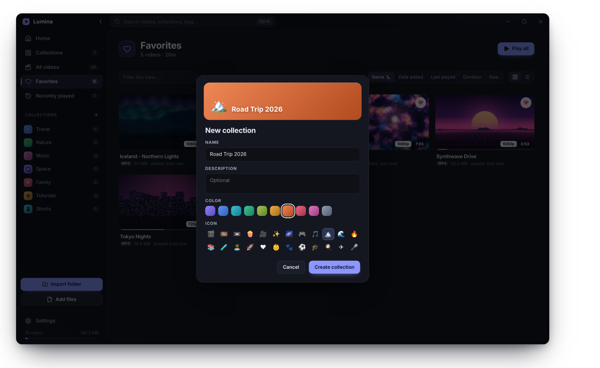<p align="center"><sub><b>Make it yours:</b> name, color and icon, with a live preview</sub></p></td>
</tr>
</table>

### A player you'll actually enjoy
Hover the seek bar for **live frame previews**. Lumina **resumes where you stopped** and keeps every control one click or one key away.


<table>
<tr>
<td width="33%">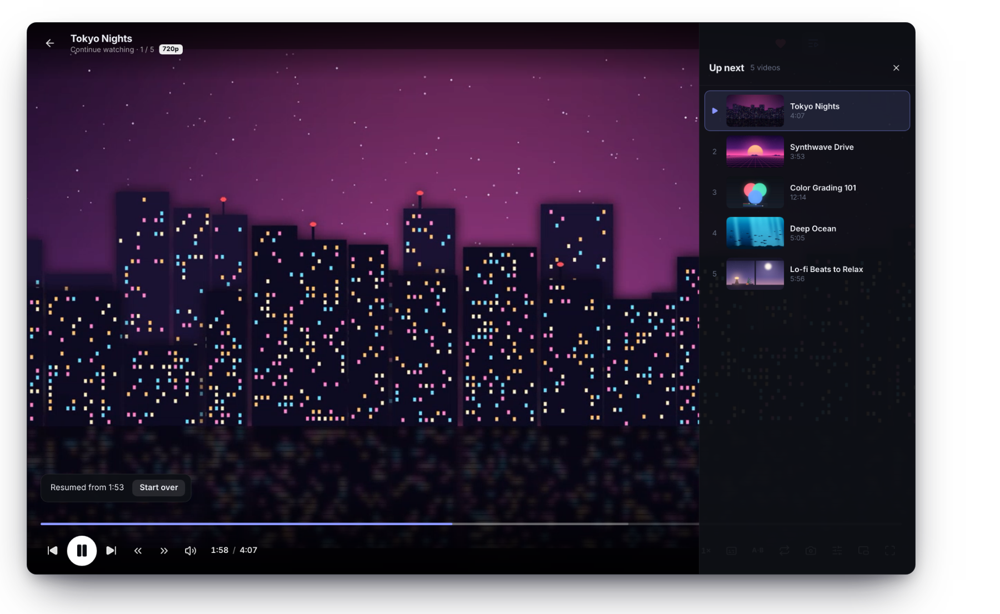<p align="center"><sub><b>Up next</b> queue</sub></p></td>
<td width="33%">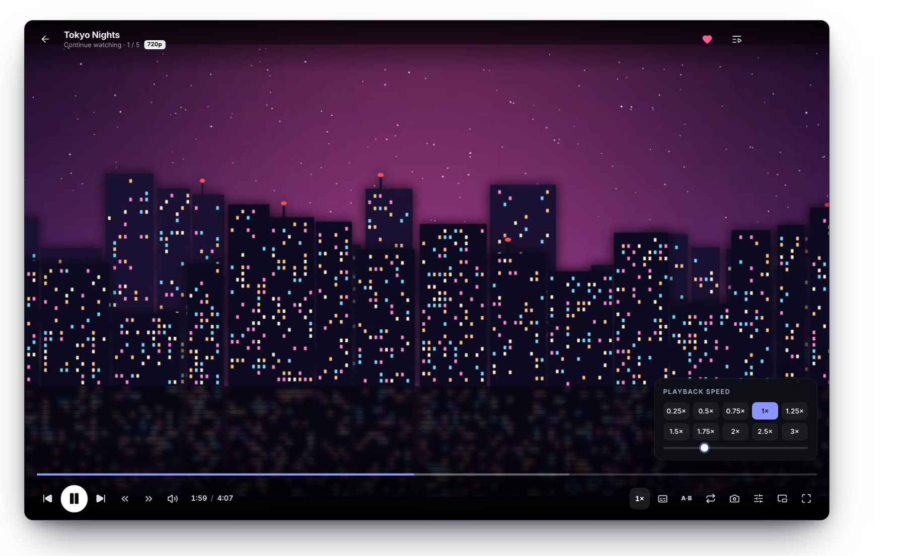<p align="center"><sub><b>0.25× – 3×</b> speed</sub></p></td>
<td width="33%">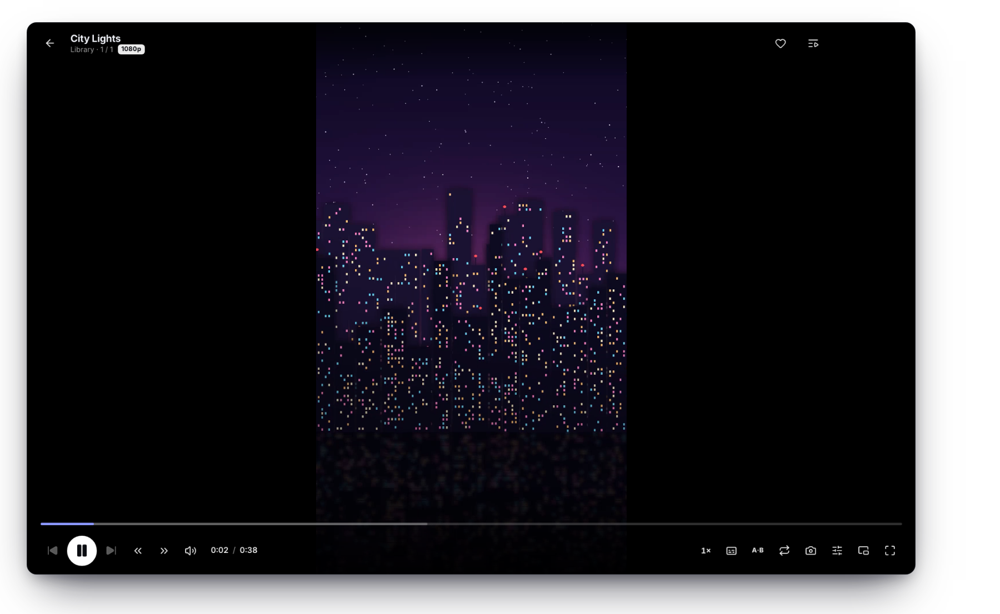<p align="center"><sub><b>Vertical videos</b> on clean black</sub></p></td>
</tr>
</table>

### Find anything, organize everything

<table>
<tr>
<td width="50%">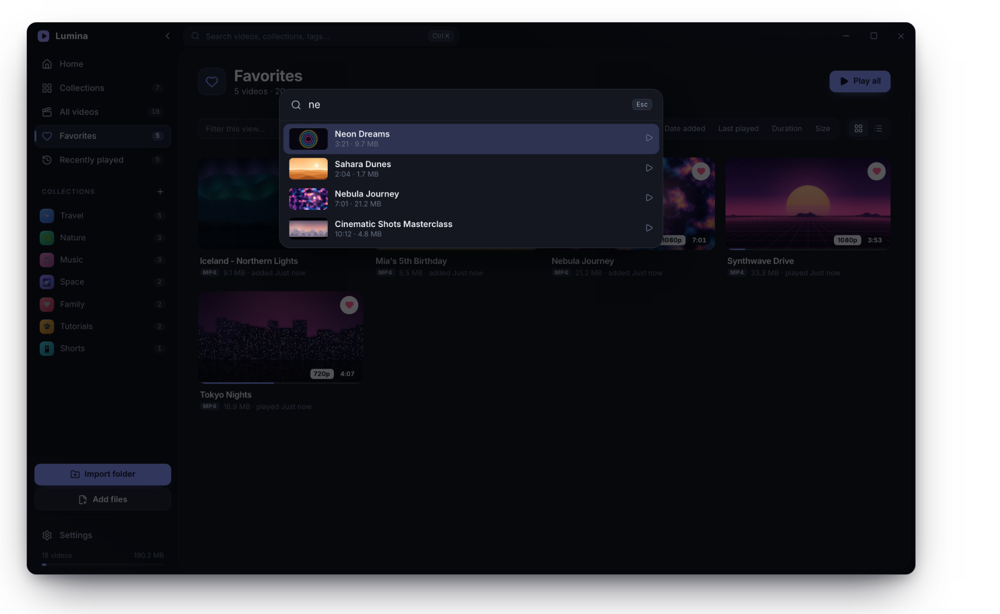<p align="center"><sub><b>Ctrl K</b> searches every video and collection</sub></p></td>
<td width="50%"><p align="center"><sub><b>Right-click</b> any video for every action</sub></p></td>
</tr>
<tr>
<td width="50%">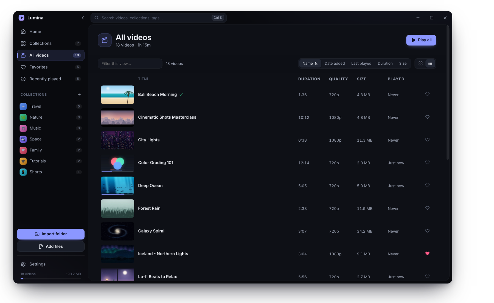<p align="center"><sub><b>List view</b> with duration, quality, size and last played</sub></p></td>
<td width="50%">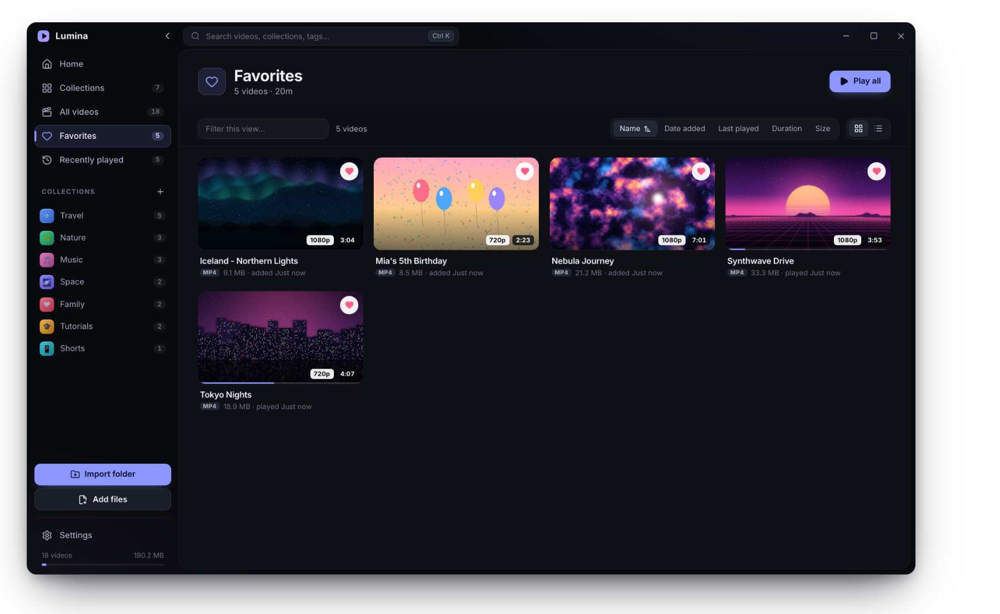<p align="center"><sub><b>Favorites</b>, one heart away</sub></p></td>
</tr>
<tr>
<td width="50%">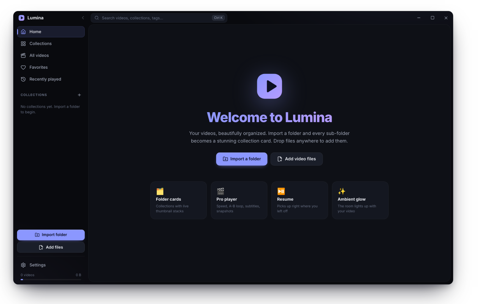<p align="center"><sub><b>First launch:</b> import a folder, or drop files anywhere</sub></p></td>
<td width="50%">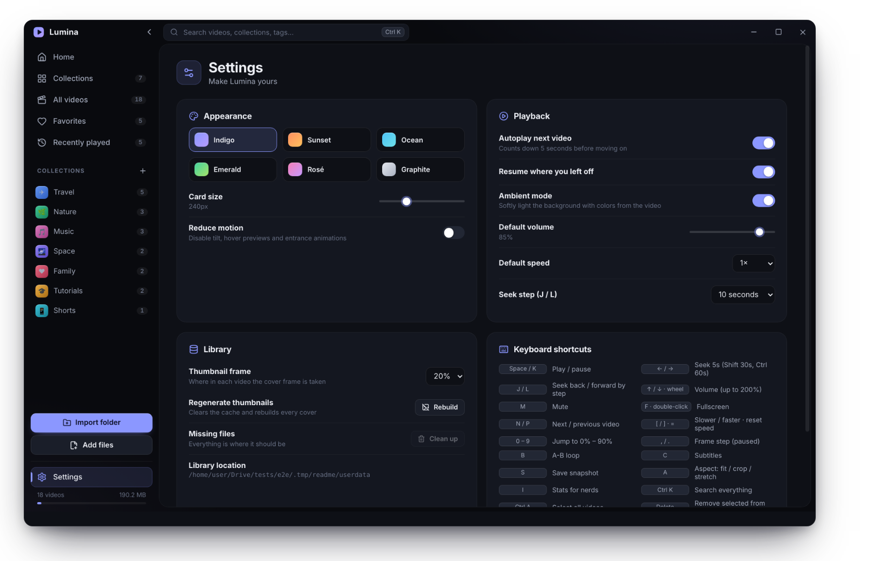<p align="center"><sub><b>Settings:</b> themes, card size, playback defaults</sub></p></td>
</tr>
</table>

<br />

## 🎨 Six themes
One calm, neutral dark design, with six accent colors to choose from.

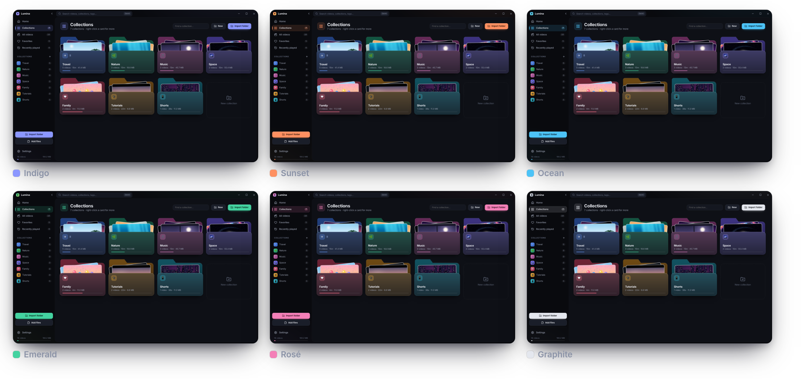

<br />

## 🧰 Everything it does

<details>
<summary><b>Library & collections</b></summary>
<br />

- **Import folders:** as one collection, or one collection per sub-folder. You can also drag files and folders from Explorer onto the window.
- **3D folder cards** that tilt, fan out their thumbnails, show watched progress, and have a quick *Play all* button.
- **Your look:** a name, description, color, emoji and cover image for every collection. Collections can be pinned too.
- **Linked folders** can be *rescanned* to pick up new files. Missing files are flagged and can be cleaned up.
- **Home dashboard:** a Continue Watching hero; stats for video count, runtime, library size and watched %; and shelves for collections and recently added videos.
- **All videos, Favorites and Recently played** views, with filtering, five sort keys, and grid or list mode.
- **Automatic thumbnails** and metadata: duration, plus 720p / 1080p / 4K badges.
- **Live hover previews:** rest the pointer on a card and it starts playing.
- **Multi-select** with Ctrl / Shift-click. Drag videos onto a sidebar collection to add them.
- **Right-click menus**, inline rename, ★ ratings, tags and a details dialog.
- **Command palette** (`Ctrl K`) searches every video and collection.
- **Six themes**, adjustable card size, and a reduce-motion mode.

</details>

<details>
<summary><b>Player</b></summary>
<br />

- **Instant open and resume**, even for multi-gigabyte MKV / MP4 files.
- **Ambient mode:** the room glows with the colors of the current frame. It's turned off for vertical videos.
- **Seek bar** with live frame previews, the buffered range and A-B loop markers.
- **Resume where you left off.** Videos are marked watched automatically at 92 %.
- Up-next autoplay with a countdown, a queue panel, and repeat for one video or the whole queue.
- **Speed** from 0.25× to 3×, and **volume boost to 200 %**.
- **Subtitles:** `.srt` / `.vtt` files next to the video load automatically, or you can load one manually.
- **Snapshots** save to `Pictures\Lumina`. Frame-by-frame stepping works while paused.
- **Picture controls:** brightness, contrast, saturation and hue, plus fit, crop and stretch.
- Picture-in-picture, fullscreen, and a *stats for nerds* overlay.
- Unsupported codecs show a clear message with an *Open in default app* button.

</details>

<details>
<summary><b>Windows integration</b></summary>
<br />

- Per-user installer: no admin rights needed, and you can choose the install folder.
- Desktop and Start Menu shortcuts, plus a proper uninstaller entry.
- **File associations** for mp4, mkv, webm, mov, avi, wmv and more. Opening a video from Explorer plays it in Lumina, reusing the running window.
- The library lives in `%APPDATA%\Lumina`. Writes are atomic, and a corrupt file is backed up rather than lost.

</details>

<br />

## ⚡ Built for speed

Every number below is measured by the benchmarks in this repo, on a machine **without a GPU**. Real Windows PCs are faster.

<table>
<tr>
<th align="left">Opening a 1.5 GB, 20-minute 1080p video</th><th>1.1</th><th>1.2</th>
</tr>
<tr><td>Open (MP4 / MKV)</td><td align="center">1.0 s / 0.36 s</td><td align="center"><b>0.14 s / 0.11 s</b></td></tr>
<tr><td>Jump to 14:00 (MP4 / MKV)</td><td align="center">2.2 s / 7.3 s</td><td align="center"><b>0.38 s / 0.34 s</b></td></tr>
<tr><td>Resume at 15:00 (MP4 / MKV)</td><td align="center">1.1 s / 7.6 s</td><td align="center"><b>0.37 s / 0.41 s</b></td></tr>
<tr>
<th align="left">An 800-video library</th><th>1.0</th><th>1.1+</th>
</tr>
<tr><td>Show the full grid</td><td align="center">1.4 – 2.7 s</td><td align="center"><b>~0.35 s</b></td></tr>
<tr><td>Switch views</td><td align="center">325 – 440 ms</td><td align="center"><b>155 – 185 ms</b></td></tr>
<tr><td>Scroll while thumbnails generate</td><td align="center">3 – 10 fps</td><td align="center"><b>33 – 37 fps</b></td></tr>
</table>

<details>
<summary><b>How it stays fast</b></summary>
<br />

- **Seeks wait for decoding to start.** Chromium can't use an index stored at the end of a file (MKV *Cues*) until playback is running. An early seek, like resuming at 15:00, used to make it scan the whole file. The player, thumbnails and seek preview now let decoding start, then jump ([`lib/media.ts`](src/renderer/src/lib/media.ts)).
- **Nothing else decodes while you watch.** Hover previews and thumbnail work stop when the player opens. The seek-bar preview decoder only loads while you hover the bar.
- **Cheap rendering.** There are no animated blur filters and no backdrop-blur over moving content. Animations only touch `transform` and `opacity`. The ambient glow is a 16×9 canvas that the GPU upscales, so it costs almost nothing.
- **Minimal re-renders.** Library updates reuse unchanged objects, so only cards that changed repaint. Off-screen cards use `content-visibility: auto`. The main process batches updates into one IPC message.
- **Background work yields to you.** Thumbnails generate two at a time and pause during playback and scrolling.

Reproduce: [`tests/e2e/open-speed.mjs`](tests/e2e/open-speed.mjs) · [`tests/e2e/perf.mjs`](tests/e2e/perf.mjs)

</details>

<br />

## ⌨️ Keyboard shortcuts

| Key | Action | | Key | Action |
| :-- | :-- | --- | :-- | :-- |
| <kbd>Space</kbd> / <kbd>K</kbd> | Play / pause | | <kbd>F</kbd> · double-click | Fullscreen |
| <kbd>←</kbd> <kbd>→</kbd> | Seek 5 s (<kbd>Shift</kbd> 30 s, <kbd>Ctrl</kbd> 60 s) | | <kbd>J</kbd> / <kbd>L</kbd> | Back / forward by step |
| <kbd>↑</kbd> <kbd>↓</kbd> · wheel | Volume (up to 200 %) | | <kbd>M</kbd> | Mute |
| <kbd>N</kbd> / <kbd>P</kbd> | Next / previous video | | <kbd>[</kbd> <kbd>]</kbd> <kbd>=</kbd> | Slower / faster / reset |
| <kbd>0</kbd> – <kbd>9</kbd> | Jump to 0 – 90 % | | <kbd>,</kbd> <kbd>.</kbd> | Frame step (paused) |
| <kbd>B</kbd> | A-B loop | | <kbd>C</kbd> | Subtitles |
| <kbd>S</kbd> | Save snapshot | | <kbd>A</kbd> | Fit / crop / stretch |
| <kbd>I</kbd> | Stats for nerds | | <kbd>Ctrl</kbd> <kbd>K</kbd> | Search everything |
| <kbd>Ctrl</kbd> <kbd>A</kbd> | Select all | | <kbd>Alt</kbd> <kbd>←</kbd> | Go back |

<br />

## 📦 Install

1. Download the latest **`Lumina-Setup-x.y.z.exe`** from **[Releases](https://github.com/mohitbansal25082006/Lumina/releases/latest)** (Windows 10 / 11, 64-bit, ~80 MB).
2. Run it and pick an install folder. The progress bar moves steadily forward, driven by the real work done.
3. Launch Lumina, click **Import folder**, and watch your folders turn into cards.

> [!NOTE]
> The installer isn't code-signed yet, so Windows SmartScreen may ask you to confirm the first time: **More info → Run anyway**.

> [!TIP]
> The built-in player plays everything Chromium does: MP4 / H.264, WebM / VP9 / AV1, most MKV and MOV. For other codecs, Lumina offers to open the file in your default app.

<br />

## 🏗️ How it's built

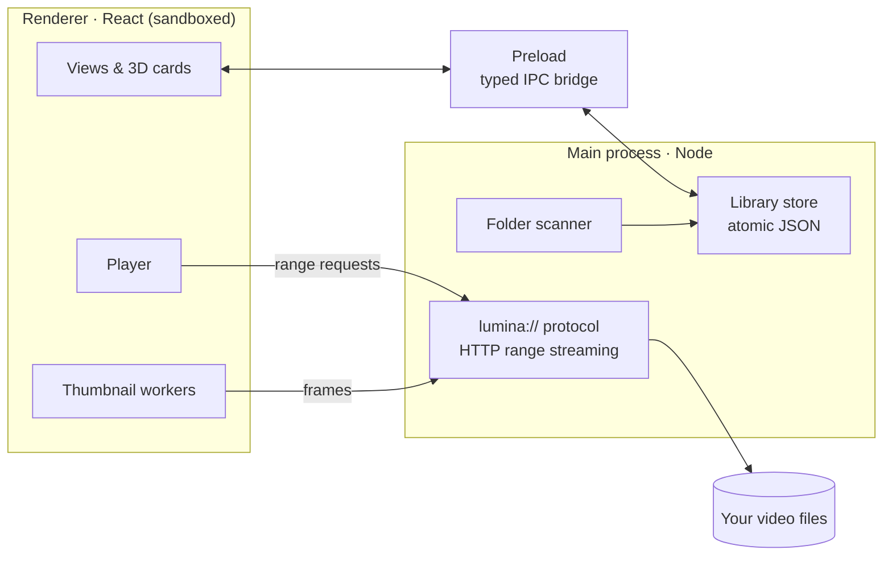

- **Main** ([`src/main`](src/main)): the library store with atomic, debounced writes and batched updates; the recursive scanner; the `lumina://` protocol, which streams files with byte ranges and only serves videos that are in your library; and SRT → VTT subtitle conversion.
- **Preload** ([`src/preload`](src/preload)): a typed, context-isolated bridge. The UI has no Node access.
- **Renderer** ([`src/renderer`](src/renderer)): React 18, Zustand and Framer Motion, with hand-written CSS.

<p>


</p>

<br />

## 🛠️ Build from source

```bash
git clone https://github.com/mohitbansal25082006/Lumina.git
cd Lumina
npm install            # also applies the installer progress patch
npm run dev            # run with hot reload
npm run typecheck
npm test               # unit tests: library, scanner, range protocol, subtitles
npm run dist:win       # → release/Lumina-Setup-<version>.exe (git-ignored; published via GitHub Releases)
```

<details>
<summary><b>Tests, benchmarks & tooling</b></summary>
<br />

| Command | What it does |
| :-- | :-- |
| `npm run build && xvfb-run -a npm run test:e2e` | Drives the real app over generated videos (23 scenarios) and writes screenshots |
| `node tests/e2e/open-speed.mjs` | Time-to-first-frame on 1.5 GB files (needs `tests/e2e/.tmp/big`) |
| `node tests/e2e/perf.mjs` | 800-video stress test: render, navigation and scroll smoothness |
| `tests/installer/record.sh` + `progress.py` | Records the real installer under Wine and checks the bar never moves backwards |
| `npm run readme:assets` | Regenerates every image in this README: paints demo scenes, builds a demo library, captures the real app, and composes the artwork |

- The e2e tests need `ffmpeg` (or `FFMPEG=/path/to/ffmpeg`).
- Building the Windows installer on Linux needs Wine with 32-bit support.
- On Windows, `npm run dist:win` works as-is.

</details>

<details>
<summary><b>Project layout</b></summary>
<br />

```
src/
  main/        library store, scanner, lumina:// protocol, subtitles
  preload/     typed IPC bridge
  renderer/    React UI (components, store, player, styles)
  shared/      types shared by both sides
build/         icons, installer artwork, installer.nsh (smooth progress)
scripts/       icon generator, exe stamping, NSIS patch, README asset pipeline
tests/         unit, e2e, benchmarks, installer checks
docs/          README artwork
release/       build output (git-ignored); installers ship via GitHub Releases
```

</details>

<br />

<div align="center">


**Lumina** is released under the [MIT License](LICENSE).<br />
<a href="https://github.com/mohitbansal25082006/Lumina/releases/latest">Download</a> · <a href="https://github.com/mohitbansal25082006/Lumina/issues">Report a bug</a> · <a href="https://github.com/mohitbansal25082006/Lumina/issues">Request a feature</a><br />
<sub>Made with ♥ for beautiful libraries.</sub>

</div>
