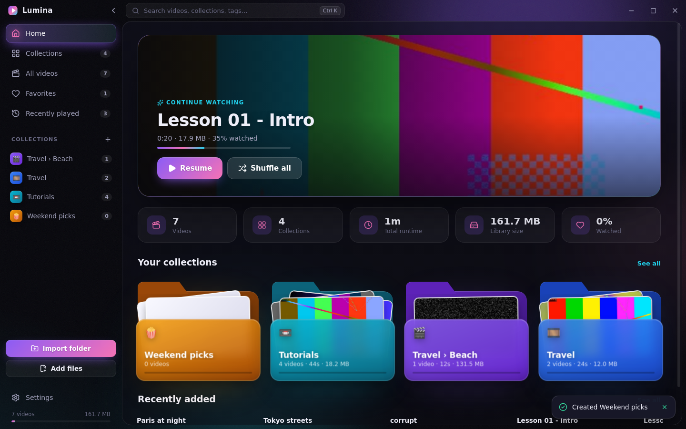
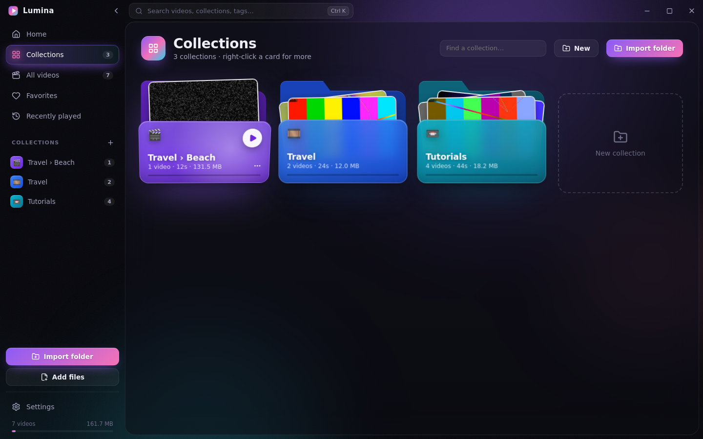
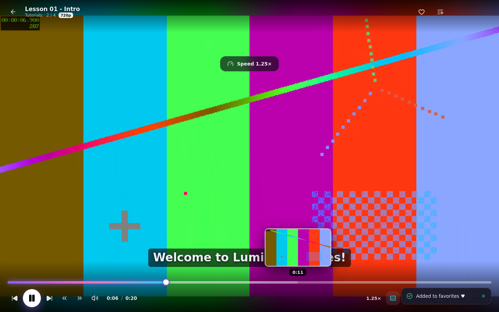
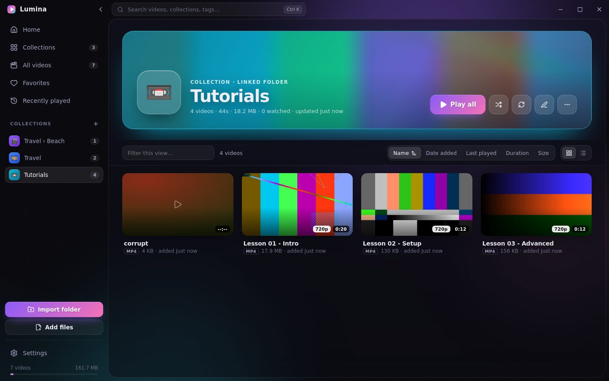
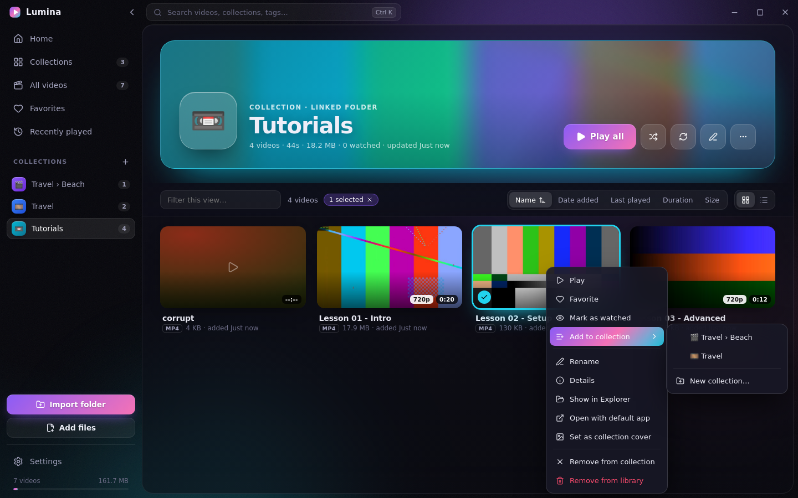

# Lumina — video player & library for Windows

Lumina turns folders of videos into **3D folder cards** you can browse, play and organize.
It has a full-featured player with ambient lighting.

**Download:** [`release/Lumina-Setup-1.0.0.exe`](release/Lumina-Setup-1.0.0.exe). It's a Windows 10/11 x64 installer.



| Collections | Player |
| --- | --- |
|  |  |
|  |  |

## Features

### Library & collections
- **Import folders**, either as a single collection or as one collection per sub-folder. You can also drag files or folders from Explorer onto the window.
- **Folder cards.** Each card is a 3D folder that tilts with the mouse and fans out thumbnails of its videos on hover. It also has a light-sheen effect, a watched-progress bar and a quick "Play all" button.
- Custom **name, description, color and emoji** for every collection. You can pin a collection, set its cover image, or delete it.
- **Linked folders** can be *rescanned* to pick up new files. Missing files are flagged and can be cleaned up.
- **Home dashboard** with:
  - a Continue Watching hero
  - library stats: count, runtime, size and watched %
  - collections and recently added shelves
- **All videos, Favorites and Recently played** views, each with filtering, five sort keys, and grid or list mode.
- **Thumbnails generated automatically** in the background, along with duration and resolution (720p/1080p/4K badges).
- **Live hover previews:** rest the pointer on a card and it starts playing.
- **Multi-select** with Ctrl/Shift-click. Drag videos onto a sidebar collection to add them.
- **Right-click menus** for every action, plus inline rename, ratings, tags and a details dialog.
- **Command palette** (`Ctrl K`) searches every video and collection.
- **Six themes:** Aurora, Sunset, Ocean, Emerald, Rosé and Graphite. There's also adjustable card size and a reduce-motion mode.

### Player
- **Ambient mode:** the room glows with the colors of the current frame.
- **Seek bar with live frame previews**, buffered range and A-B loop markers.
- **Resume where you left off.** Videos are marked watched automatically at 92%.
- Up-next autoplay with a countdown, a queue panel, and repeat for one video or the whole queue.
- **Speed** from 0.25× to 3×, and **volume boost up to 200%** (Web Audio).
- **Subtitles:** `.srt`/`.vtt` files next to the video load automatically, or you can load one manually.
- **Snapshots** save to `Pictures\Lumina`. Frame-by-frame stepping works while paused.
- **Picture controls:** brightness, contrast, saturation and hue, plus fit, crop and stretch.
- Picture-in-picture, fullscreen, and a "stats for nerds" overlay.
- Unsupported files show a clear message with an "Open in default app" button instead of failing silently.

### Keyboard shortcuts

| Key | Action | Key | Action |
| --- | --- | --- | --- |
| `Space` / `K` | Play / pause | `F` / double-click | Fullscreen |
| `←` `→` | Seek 5 s (Shift 30 s, Ctrl 60 s) | `J` / `L` | Seek back / forward by step |
| `↑` `↓` / wheel | Volume | `M` | Mute |
| `N` / `P` | Next / previous | `[` `]` `=` | Slower / faster / reset |
| `0`–`9` | Jump to 0–90 % | `,` `.` | Frame step (paused) |
| `B` | A-B loop | `C` | Subtitles |
| `S` | Snapshot | `A` | Aspect mode |
| `I` | Stats overlay | `Ctrl K` | Search |

## Installer
- NSIS installer with a custom sidebar image. It lets you choose the install directory and installs per-user, so no admin rights are needed.
- Creates **Desktop and Start Menu shortcuts** and an uninstaller entry.
- **File associations** for mp4, mkv, webm, mov, avi, wmv and more. Opening a video from Explorer plays it in Lumina, reusing the running instance.
- The library lives in `%APPDATA%\Lumina\library.json`. Writes are atomic, and a corrupt file is backed up rather than lost. Thumbnails are stored in `%APPDATA%\Lumina\thumbs`.

## Tech
Electron 33 · React 18 · TypeScript · Vite (electron-vite) · Framer Motion · Zustand · electron-builder.

- `src/main`: the library store (JSON persistence), folder scanner, the `lumina://` protocol, which streams files with HTTP range support so seeking is instant, and subtitle conversion.
- `src/preload`: a typed, context-isolated IPC bridge.
- `src/renderer`: the UI.

The renderer has no Node access, and only videos in the library are served through the protocol.

## Development

```bash
npm install
npm run dev          # launch with hot reload
npm run typecheck
npm test             # unit tests (library, scanner, range protocol, subtitles)
npm run build && xvfb-run -a npm run test:e2e   # end-to-end: drives the real app, writes screenshots
npm run dist:win     # -> release/Lumina-Setup-<version>.exe
```

The e2e suite generates real test videos, so it needs `ffmpeg` on `PATH`, or `FFMPEG=/path/to/ffmpeg`.
Building the Windows installer on Linux needs Wine with 32-bit support, because NSIS runs the stub to generate the uninstaller.
On Windows, `npm run dist:win` works as-is. `scripts/after-pack.cjs` stamps the icon and version info into `Lumina.exe` with a pure-JS PE editor, so no rcedit/Wine is needed for that step.

The installer is not code-signed, so Windows SmartScreen may ask you to confirm ("More info → Run anyway").
